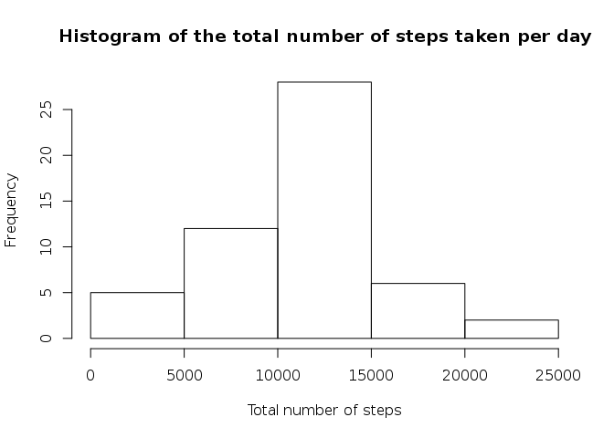
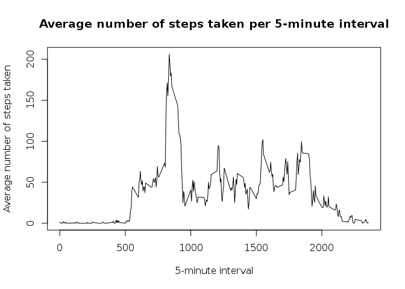
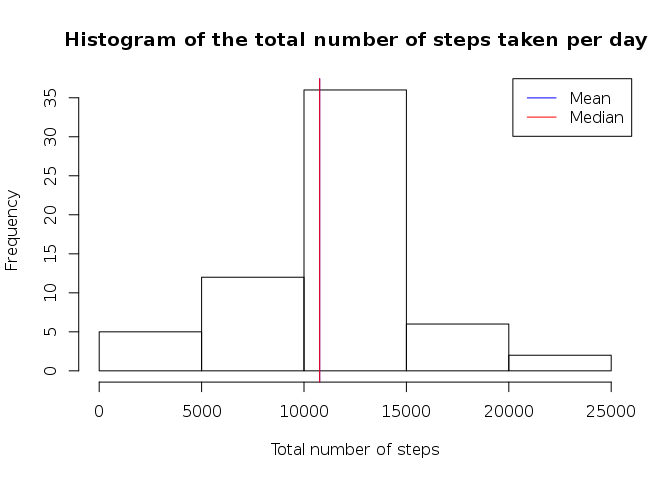
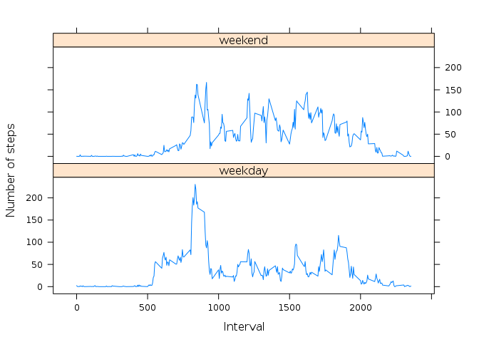

# Reproducible Research: Peer Assessment 1


## Loading and preprocessing the data

We unzip and load the data.


```r
unzip('activity.zip')
data <- read.csv('activity.csv', colClasses = c('integer', 'Date', 'integer'))
```


## What is mean total number of steps taken per day?

This is the histogram of the total number of steps taken per day.


```r
total <- aggregate(steps ~ date, data, sum)
hist(total$steps, main="Histogram of the total number of steps taken per day", xlab="Total number of steps")
```

 

We calculate the mean of the total number of steps taken per day.


```r
stepsMean <- mean(total$steps)
stepsMean
```

```
## [1] 10766.19
```

We calculate the median of the total number of steps taken per day.


```r
stepsMedian <- median(total$steps)
stepsMedian
```

```
## [1] 10765
```

This is the histogram with the mean and median report on it.


```r
hist(total$steps, main="Histogram of the total number of steps taken per day", xlab="Total number of steps")
abline(v=stepsMean, col="blue")
abline(v=stepsMedian, col="red")
legend('topright', c('Mean', 'Median'), col=c('blue', 'red'), lwd=1)
```

 


## What is the average daily activity pattern?

This is the average number of steps taken per 5-minute interval.


```r
average <- aggregate(steps ~ interval, data, mean)
plot(type='l', average$interval, average$steps, main="Average number of steps taken per 5-minute interval", xlab="5-minute interval", ylab="Average number of steps taken")
```

 

We calculate the 5-minute interval which contains the maximum number of steps.


```r
average[which.max(average$steps),"interval"]
```

```
## [1] 835
```


## Imputing missing values

We will observe the missing values of the dataset.

This is the number of row in the dataset with missing values for the number of step.


```r
nrow(data[is.na(data),])
```

```
## [1] 2304
```


We will replace missing values by the mean of the number of step for the 5-minute interval on all days.

We store this new dataset in *dataWithoutNA*.


```r
dataWithoutNA <- data
dataWithoutNA$steps <- ifelse(is.na(dataWithoutNA$steps), average$steps, dataWithoutNA$steps)
```

This is the histogram of the newly generated dataset.


```r
totalWithoutNA <- aggregate(steps ~ date, dataWithoutNA, sum)
stepsWithoutNAMean <- mean(totalWithoutNA$steps)
stepsWithoutNAMedian <- median(totalWithoutNA$steps)
hist(totalWithoutNA$steps, main="Histogram of the total number of steps taken per day", xlab="Total number of steps")
abline(v=stepsWithoutNAMean, col="blue")
abline(v=stepsWithoutNAMedian, col="red")
legend('topright', c('Mean', 'Median'), col=c('blue', 'red'), lwd=1)
```

 

The mean and the median of this newly generated dataset are respectively : 10766.19 and 10766.19. The mean hasn't change. The median value would now move closer to the mean. It makes sense : complete days were missing in the original data, so the total number of steps taken per day is not affect.

## Are there differences in activity patterns between weekdays and weekends?

We add a new factor variable *daytype* with two levels : "*weekday*" and "*weekend*"


```r
locale <- Sys.setlocale("LC_TIME", "C") # For names to be in english
dataWithoutNA$daytype <- ifelse(weekdays(dataWithoutNA$date) %in% c('Saturday', 'Sunday'), "weekend", "weekday")
dataWithoutNA$daytype <- factor(dataWithoutNA$daytype)
```

We represent the number of steps per interval on the weekdays et on the weekend.


```r
library(lattice)
average <- aggregate(steps ~ interval + daytype, dataWithoutNA, mean)
xyplot(steps ~ interval | daytype, data=average, type="l", xlab="Interval", ylab="Number of steps", layout=c(1,2))
```

 
